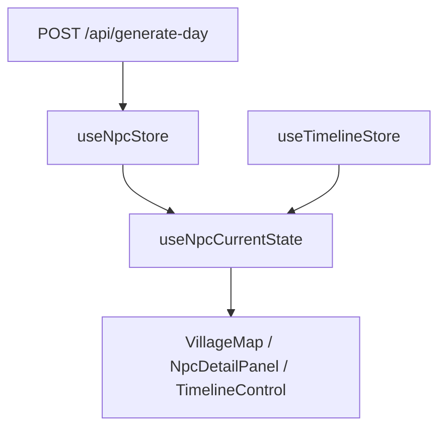

# 溪桥镇 NPC 社会仿真（LanxiZhen）

[](https://github.com/zhengli12305/LanxiZhen/actions/workflows/ci.yml)

**Live Demo：** [https://lanxizhen.vercel.app](https://lanxizhen.vercel.app)（部署后替换为实际 URL）

> AI 一次生成六位居民的关系网日程，时间轴回放社会仿真，点击看内心独白与同场对话。


## 截图预览

| 骰子入场 | 村庄地图 | 详情面板 |
|---------|---------|---------|
|  |  |  |

> 可将 `docs/screenshots/*.svg` 替换为 `npm run dev` 截取的真实 PNG 截图。

## 演示视频

<video src="docs/videos/demo.mp4" controls width="100%"></video>

> 以上为 README 预览用压缩版（约 1.3MB）。完整交互请访问 [Live Demo](https://lanxizhen.vercel.app)。

## 项目亮点（简历可用）

- 基于 **Nuxt 4 + Pinia** 实现 NPC 社会仿真，服务端 **DeepSeek** 一次批量生成 6 人结构化日程，含 **JSON 校验与失败重试**
- 设计「**单一时间源 + 派生状态**」架构，`useNpcCurrentState` 根据时间轴实时计算位置/动作，避免多源状态同步
- 实现 **Three.js 极光封面**入场（拖拽骰子选角）、**Kenney 像素地图**与 NPC 移动动画，形成可部署的完整产品闭环

## 技术栈

- Nuxt 4（SSR + Nitro）
- Vue 3 + TypeScript（严格模式）
- Pinia 状态层
- Three.js（封面 WebGL 场景）
- DeepSeek API（仅服务端，可选）
- Kenney Tiny Farm 像素贴图（CC0）

## 架构



## 与 Stanford Generative Agents 对比

| 维度 | Generative Agents（原版） | 溪桥镇（本项目） |
|------|--------------------------|------------------|
| 运行时 | Python + Django + Phaser | Nuxt 4 全栈 Web |
| 认知架构 | 记忆 / 反思 / 规划完整链路 | 批量日程 + 独白 + 轻量对话 |
| 地图 | 游戏引擎实时渲染 | DOM + Kenney 像素格 |
| 目标 | 研究复现 | 可演示的产品级作品集 |
| 演示门槛 | 需本地双端启动 | 一键部署，mock 兜底 |

## 技术决策

| 决策 | 原因 |
|------|------|
| 一次 API 生成 6 人全天 | 省 token、保证关系一致性 |
| 派生 state 不存 runtime | 时间轴一动，全图自动重算 |
| Three.js 封面 + Canvas 贴图骰子 | 极光/星场氛围，拖拽选角，ClientOnly 挂载 |
| 无 Key 走 mock | 面试官打开 Demo 无需配置 |

## 快速开始

```bash
npm install
cp .env.example .env   # 可选：填入 DEEPSEEK_API_KEY
npm run dev
```

打开 [http://localhost:3000](http://localhost:3000)：

1. 玩骰子选人（Three.js 封面，后台预取当日日程）
2. 进入村庄：06:00 暂停、详情面板自动打开
3. 播放时间轴，观察 NPC 移动与独白
4. 点击「精彩时刻」跳转关系戏剧高潮

**最佳体验：** 桌面端（≥768px），移动端已做基础适配。

```bash
npm run test:smoke   # 校验器与 prompt 冒烟测试
npm run lint
npm run build
```

开发调试（仅 `npm run dev` 可访问）：
- [http://localhost:3000/test-generate](http://localhost:3000/test-generate) — AI 生成 + 元数据观测
- [http://localhost:3000/dev/tiles](http://localhost:3000/dev/tiles) — Kenney 贴图索引

## 部署到 Vercel

1. [Vercel](https://vercel.com) → Import GitHub 仓库 `zhengli12305/LanxiZhen`
2. Framework Preset：**Nuxt**
3. **不要**设置 `DEEPSEEK_API_KEY`（Demo 自动使用 mock 数据，打开即玩）
4. Deploy 完成后，将 README 顶部 Live Demo 链接替换为实际 URL

仓库已包含 [`vercel.json`](vercel.json)。

## 当前功能

- [x] Three.js 极光封面 + 拖拽骰子选角 + menubar（角色一览 / 关系速览）
- [x] 封面 16:9 录制 / 暂停控件
- [x] 村庄地图 + NPC 移动动画
- [x] 时间轴回放 + 精彩时刻跳转
- [x] 详情面板当前时刻高亮 + 同场对话
- [x] 地图同场聚集 💬 标记
- [x] AI 生成 / mock / 缓存 / JSON 校验
- [x] GitHub Actions CI

## 文档

设计说明见 [`docs/`](docs/) 目录。

## 仓库

[https://github.com/zhengli12305/LanxiZhen](https://github.com/zhengli12305/LanxiZhen)
